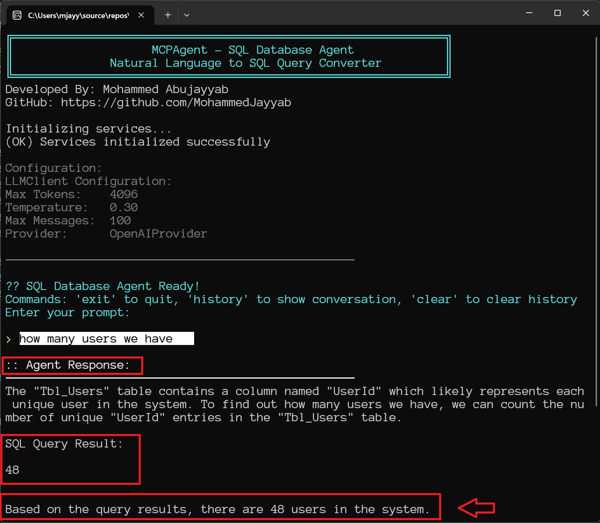

# MCPAgent - SQL Database Agent

A Model Context Protocol (MCP) agent that converts natural language prompts into SQL operations using [LLMKit](https://www.nuget.org/packages/LLMKit).

## About LLMKit

This project uses [LLMKit](https://www.nuget.org/packages/LLMKit), a thread-safe .NET library that provides a unified interface for interacting with various Large Language Models (LLMs) including OpenAI, Gemini, and DeepSeek.

## Features

- **Natural Language to SQL**: Convert plain English queries to SQL operations
- **Multi-Provider LLM Support**: Works with OpenAI, Gemini, and DeepSeek
- **Dynamic Schema Discovery**: Automatically discovers database structure
- **Conversation Memory**: Maintains context across interactions
- **Autonomous Agent**: LLM decides what queries to run and when

## Quick Setup

1. **Copy the example configuration:**
   ```bash
   cp appsettings.example.json appsettings.json
   ```

2. **Edit `appsettings.json` and configure:**

       **Choose your LLM provider (pick one):**
    ```json
    {
      "LLMKit": {
        "Provider": "OpenAI",  // or "Gemini" or "DeepSeek"
        "Gemini": {
          "ApiKey": "your-gemini-api-key-here",
          "Model": "gemini-1.5-flash"
        },
        "OpenAI": {
          "ApiKey": "your-openai-api-key-here",
          "Model": "gpt-4"
        },
        "DeepSeek": {
          "ApiKey": "your-deepseek-api-key-here",
          "Model": "deepseek-chat"
        },
        "Settings": {
          "MaxTokens": 4096,
          "Temperature": 0.3,
          "MaxMessages": 100
        }
      },
      "Database": {
        "ConnectionString": "Server=your-server;Database=your-database;Trusted_Connection=true;TrustServerCertificate=true;"
      }
    }
    ```

3. **Run the application:**
   ```bash
   dotnet run
   ```

## Usage

The agent provides an interactive console interface:



```
SQL Database Agent Ready!
Commands: 'exit' to quit, 'history' to show conversation, 'clear' to clear history
Enter your prompt:

> how many users we have
> which users are disabled
> show me all payments for user ID 5
> find users who haven't logged in for 30 days
```

### Example: Count Users

**User Prompt:**
```
> how many users we have
```

**Agent Response:**
```
I need to explore the database schema to find the table containing user information and then count the number of users.

Tool: SQLQuery
Args: SELECT TABLE_NAME FROM INFORMATION_SCHEMA.TABLES WHERE TABLE_TYPE = 'BASE TABLE'

SQL Query Result:
TABLE_NAME
Tbl_Users
Tbl_Payments
Tbl_SystemLogs
...

Now I'll count the users in the Tbl_Users table.

Tool: SQLQuery
Args: SELECT COUNT(*) FROM Tbl_Users

SQL Query Result:
48

Based on the query result, there are 48 users in the database.
```

### Example Queries

- **Count queries**: "how many users we have"
- **Filter queries**: "which users are disabled"
- **Join queries**: "show me all payments for user ID 5"
- **Complex queries**: "find users who haven't logged in for 30 days"

## How It Works

1. **Schema Discovery**: The LLM automatically discovers your database structure
2. **Query Generation**: Converts your natural language to SQL queries
3. **Execution**: Runs the queries and returns results
4. **Conversation**: Maintains context for follow-up questions

## Connection String Examples

**Windows Authentication:**
```
Server=localhost;Database=YourDatabase;Trusted_Connection=true;TrustServerCertificate=true;
```

**SQL Server Authentication:**
```
Server=localhost;Database=YourDatabase;User Id=YourUsername;Password=YourPassword;TrustServerCertificate=true;
```

## Getting API Keys

- **OpenAI**: https://platform.openai.com/api-keys
- **Gemini**: https://makersuite.google.com/app/apikey
- **DeepSeek**: https://platform.deepseek.com/api-keys

## Prerequisites

- .NET 8.0 or later
- SQL Server database
- Valid API key for your chosen LLM provider

## Security Note

Never commit your actual `appsettings.json` file to version control - it contains sensitive information!

## License

This project uses the [LLMKit library](https://www.nuget.org/packages/LLMKit) which is licensed under MIT License.
